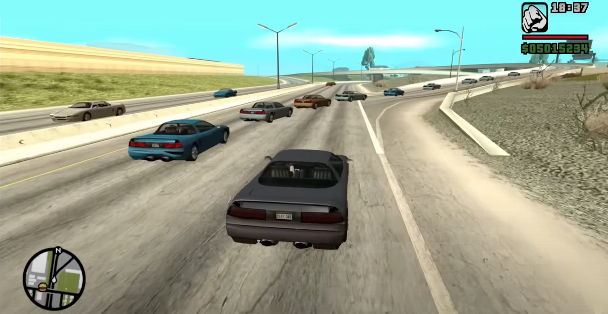

Have you seen that image above? It's when you stroll around, looking for a particular car. You spend quite some time searching, then when you finally find it, the cars start appearing everywhere.

You facepalm in response, realizing all the time you wasted trying to find that car. Yeah, I felt that.

So what exactly happened? One thing's for sure - it's not your imagination. It's a deliberate system made by Rockstar Studios for GTA San Andreas.

But what's it for? To put it simply: to keep the game running smoothly on your PlayStation 2 console.

You see, this game was originally made for PS2, so most of the game's features were constrained by that hardware. The PS2 wasn't exactly a beast when it came to specs. It was limited to only 32MB of RAM, which meant that games released on it needed serious memory management to run properly.

For GTA San Andreas - an open world game with over 180 vehicles available, multiple cars and tons of pedestrians active at once - yeah, you definitely need some high-level optimization. This vehicle model limit system is just one way to achieve that.

::github{repo="gta-reversed/gta-reversed"}

## 8 Model Limit System

:::important[Before we start..]
Alright, you should know that GTA San Andreas has been reverse engineered by a group of people. In other words, people understand quite well how the game works under the hood. The things I'll explain here were also confirmed by former Rockstar dev Obbe Vermeij, who actually worked on this exact logic. It's actually being explained better by himself [here](https://x.com/ObbeVermeij/status/1790730197286752530), but I re-explain it my way to actually help myself understanding it better. Just imagine, you sat across me as I yap.
:::

Anyway, let's talk about it.

The game can only "spawn" around 110 vehicles at once. That's all the cars driving around, passing by, and parked near you.
Now, remember when I said there are more than 180 vehicle models available in the game? Because of PS2's limited memory though, the game can only remember so much. It can only remember 8 models of vehicles at a time. (Don't forget the memory also has other tasks, so Rockstar limited it for that reason.)

That's why when you're driving around, you tend to see the exact same cars again and again until you move out of the area.

With me so far?

Alright, so the kinds of vehicles the game remembers depend on a few things.

First: your area. For example, poor areas, business districts, rich neighborhoods. In rich areas, you tend to see sports cars, like the one in the thumbnail: the Turismo.

There are several other sports cars, but which one gets loaded is based on chance. In this case, the Turismo gets chosen and occupies one of the 8 available slots, alongside 7 other cars.

The other 7 could be a combination of many types: service cars (ambulance or taxi), police cars, vans, muscle cars, or even another sports car.

As you move from a rich area to a poor one, cars get phased out once they're off the map, and the slot basically rerolls. So the Turismo you saw before has a chance to get unloaded once you leave the initial area, being replaced by vehicles like the Greenwood, for example.

If you ask: "Then why are there Turismos in the Vinewood (middle class) area?" - like in the picture - good question!

Think about it for a second... Why?

It's because of the second point: the car you're currently driving. This is basically a special case where the game prioritizes loading the vehicle you're currently driving. So regardless of your area, the vehicle you're driving will always be in memory. It might take you ages to find a Turismo, but once one appears, they're suddenly all over the place.

Now you know why.

As for "why in the picture they're all the exact same cars" - that's a joke, but it could theoretically happen by chance. Very small chance though.

The vehicles you see are also determined by missions you're currently doing and your recent interactions. For example, the motorcycle from "the damn train, CJ" mission (Sanchez) will probably appear at least once more during that mission.

## What about the PC version?

Good question! Unlike PS2, PC isn't limited to 32MB of RAM anymore. Although, sorry to say, it's more or less the same. The PC version was released as a 32-bit application, so it could only utilize about 2GB of your PC's RAM - not because of a 2GB limit specifically, but because that's roughly how much the 32-bit application actually uses in practice.

The PC port of GTA SA is basically the same as the PS2 version. That's because the game was "hardcoded" for PS2 and Rockstar made no further effort to optimize it for PC.

<iframe width="100%" height="468" src="https://www.youtube.com/embed/VPgb6b4S2tM?si=TEz14otE3lcqRT1_" title="YouTube video player" frameborder="0" allowfullscreen></iframe>

That means the vehicle model limit still exists in the game. In fact, several other limitations still exist too.

I'm too lazy to make an extensive effort to explain, but yeah - did you know you swim slower at 60FPS rather than 30FPS? Also, you might find cars harder to drive at higher FPS. Oh, and your bike is slower at higher FPS too.

The game is hardcoded for 25 FPS - that's about the frame limit of PS2, and they made little effort optimizing for 60FPS.

:::tip[of note]
All of these limitation has been fixed by community-released patches. SilentPatch is a good one that fixes all the limitations I mentioned.
:::

## TL;DR
Because of PS2's memory constraints, the game can only remember around 8 vehicle models at a time, and it especially remembers the car you're driving.

So when you drive a Turismo, they tend to appear more frequently.

It's the same case for every 3D universe GTA (like III and Vice City), and even HD universe games like IV. Some players have noticed the same thing in V - though that's not confirmed by anybody yet.