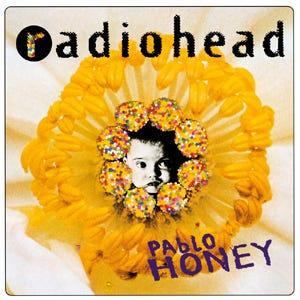
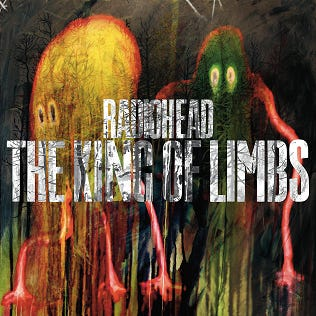
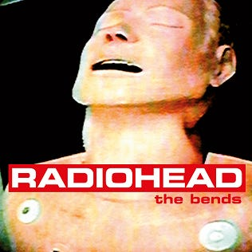
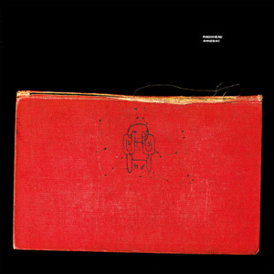
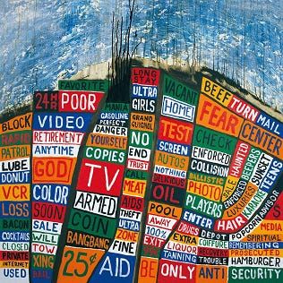
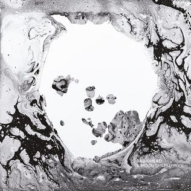
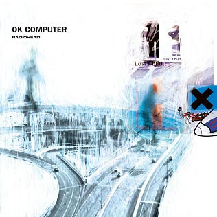
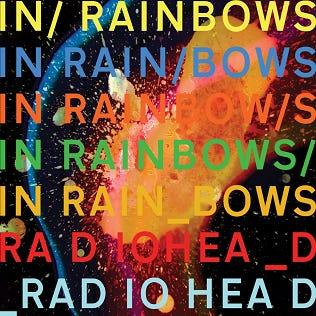
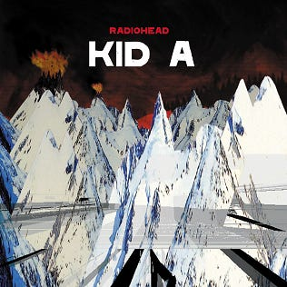
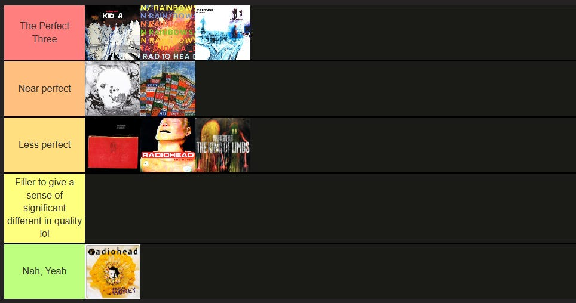

For a while now, Radiohead has been my favorite band. I've been listening to them to the point of obsession, exploring every single part of their discography, and reading a lot of their stories and interviews.

On this blog, I'm pouring most of my thoughts toward each album, all the while making a tier list—something that I had sworn not to make but obviously made anyway.

*Anyway, let’s dive in immediately.*

---

## 9. Pablo Honey

“Pablo Honey” is the debut album of Radiohead, released in February 1993. The album consists of 12 songs and with a total runtime of 42 minutes. While the primary sonic influence is the grunge genre, “Pablo Honey” exhibits a mix of multiple musical styles, such as alternative rock, stadium rock, post-grunge, and more.

“Pablo Honey” introduced the iconic song “Creep,” a song which catapulted Radiohead to the pinnacle of the British music charts during the early '90s. However, critics have often stated that “Creep” was the album’s sole standout, with many listeners acquiring the album solely for this track. This led some media to label Radiohead as a “one song band” and “a one hit wonder.”

Interestingly, Radiohead has expressed disfavor to this album themselves, citing its lack of originality. They’ve stated it as sounding like they were playing in their dorm room with a small audience of friends. Additionally, the production and recording process for this album was rushed, taking a few months to complete.

This album is a no-brainer on the bottom of my list. While it has a few memorable tracks, it mostly sounds unoriginal and fails to carve out a distinctive identity. The sonic landscape remains consistent from start to finish, and I have a challenge distinguishing one song from another.

Top 3: Creep, Blow Out, You

<iframe width="100%" height="468" src="https://www.youtube.com/embed/XFkzRNyygfk?si=eUH-ikS79DiH_-YM" title="YouTube video player" frameborder="0" allowfullscreen></iframe>

When thinking of 'Pablo Honey,' three tracks immediately come to mind. 'Creep' stands out with its iconic guitar riff and immense popularity. 'Blow Out' hints at Radiohead's future sound, showcasing Thom Yorke's melancholic vocals and the bands’ subtle experimentation. Lastly, 'You,' as the album opener, is memorable because of Thom Yorke's unexpected mid-song scream.

---

## 8. The King of Limbs

“The King of Limbs” is the eighth studio album of Radiohead released in February 2011. It consists of 8 songs, spanning 37 minutes, relatively shorter than other Radiohead releases. This album contrasts most of the others within the band’s discography, featuring ballads, ambient psychedelia, extensive sampling and looping, showcasing the band’s penchant for sonic experimentations..

The album was inspired by the emergence of new tools for live-sampling. Ed O’ Brien stated that the recording process as a “bit of a gamble,” departing from conventional methods in favor of studio experimentation that minimized editing, resulting in more live and direct recordings.

Expectations for the album's success were modest, and unlike the other albums, the band approached it with a non-judgmental attitude. Despite that, the album did gain considerable amount of success upon its release, having over 400,000 downloads and earning multiple nominations for Best Alternative Album in 2011.

Selecting a comfortable album for this position was a challenge, but I've settled on "The King of Limbs." Honestly, it was off my radar for far too long due to its lackluster reputation. However, upon my first listen, which happened to be the live "From The Basement" version, I didn't find it as terrible as some say. In fact, that live version resonated much better with me than the initial studio release.

Each Radiohead album seems to embody different emotions, and "The King of Limbs" leans towards a sense of neutrality. Despite the infectious sounds of tracks like "Lotus Flower," the looping beat of "Bloom," and the head-bopping quality of songs like "Morning Mr. Magpie" and "Little by Little," it lacks that extra punch that defines an "awesome" album.

"The King of Limbs" has its own mood. Sometimes, when I've had my fill of the unique and loud sounds from other albums, tuning in to this one feels just right. It may not be a masterpiece or a contender for the best, but it's like a soothing sedative that calms you down after experiencing the masterpieces.

Top 3: Separator, Lotus Flowers, Bloom

<iframe width="100%" height="468" src="https://www.youtube.com/embed/D2084nQbmvk?si=ZvQdv_YxCYNbULIy" title="YouTube video player" frameborder="0" allowfullscreen></iframe>

"Separator" stands as my overall favorite, a psychedelic gem adorned with uplifting lyrics that mark a departure from the band's previous paranoid attitude. It emits a calming aura, gently whispering, "Don't worry, have a good night's sleep." 

"Lotus Flower" never fails to induce dance with its captivating bass lines, infectious melody, and the quirky allure of its music video, all accompanied by Thom Yorke's mesmerizing vocals. As for "Bloom," it's a captivating album opener starting with a simple guitar loop and gradually layering in other instruments until Thom's entry, building into an explosion that's impossible not to sing along to.

---

## 7. The Bends

“The Bends” is the second studio album of Radiohead released in March 1995, consisting of 12 songs across 48 minutes. Its title draws from the term for decompression sickness, referencing their rapid rise due to the success of “Creep.”

Before “The Bends,” Radiohead had been pegged as potential one-hit wonders, but this album defied expectations and marked a turning point for the band, solidifying their status as one of the most promising bands within the music industry. This album wasn’t a worldwide hit like Creep, however it remains a highly influential album, especially for post-Britpop bands and as a crucial stepping stone in Radiohead’s own evolution.

“The Bends” is an essential Britpop album, primarily driven by guitars. It also marked Radiohead's foray into studio experimentation, adding layers and textures that ventured into other domains, including neo-psychedelia, notably showcased in the intro of "Planet Telex."

This album settled into the seventh spot on my list, though if you’d asked me a few months ago, I really have no interest in it.

One of the reasons I don't listen to "The Bends" as often is the frequency of love songs accompanied by acoustic guitars, a genre not typically on my Radiohead playlist, as I lean towards more complex, rough sounding music. I've grown to appreciate acoustic music for its emphasis on vocals and lyrics, but my preference still gravitates towards its more experimental, multilayered tracks. "The Bends" does have its moments that fit this criteria, particularly "Just" and "Planet Telex."

Top 3: Just, My Iron Lung, Planet Telex

<iframe width="100%" height="468" src="https://www.youtube.com/embed/oIFLtNYI3Ls?si=GMH4MxN8THxNmEL0" title="YouTube video player" frameborder="0" allowfullscreen></iframe>

"Planet Telex" surprises as the album opener with Jonny Greenwood's keyboard creating a spacey soundscape. "My Iron Lung" starts with an epic guitar solo, preceded to be an alternative to typical alt-rock through its experiments and thought-provoking lyrics. "Just" follows, shares some similarities, with its resonant line "you do it to yourself" and another standout guitar solo, making it one of my favorite straightforward rock songs by Radiohead.

An honorable mention also is “Fake Plastic Trees,” featuring mainly acoustic guitar that builds up into a powerful ballad. It is one of Radiohead’s acoustic song that I’ve first embraced.

---

## 6. Amnesiac

“Amnesiac," released in May 2001, emerged as a follow-up to the groundbreaking "Kid A," sharing the same recording session. As the sequel to "Kid A," it continues Radiohead's exploration of electronic elements.In "Amnesiac," the band delves deeper into their sonic experimentation.

The album features a mix of different styles, including experimental rock, electronic, jazz, and classical music. The album is known for its ambiguity and challenging material that requires effort on the part of the listener to make sense of, both in terms of sonically or lyrically. It inherits the abstracted style of the preceding album.

“Amnesiac” is remarkably varied; just listening to the first three songs can leave you flabbergasted.. It shifts between full-on electronic vibes and jazzy undertones, a testament to Radiohead's audacious experimentation with different sounds.

While "Amnesiac" offers moments of brilliance, it does have its ups and down. The abstraction of "Pulk/Pull Revolving Doors" might come off as underwhelming, despite its intriguing sounds. However, the album peaks on impressive heights with the dramatic crescendo of "You and Whose Army?" and the evocative "Life in a Glasshouse.”

The bold experimentations found in "Amnesiac" might not resonate with everyone, but it's precisely what elevated this album above "The Bends" in my ranking. For a significant period, it held the top spot on my list, the sole reason being its willingness to traverse diverse musical genres. However, at the same time, it comes quite short compared to some albums.

Top 3: Pyramid Song, You & Whose Army?, Life in a Glasshouse

<iframe width="100%" height="468" src="https://www.youtube.com/embed/QQnc-hM80UQ?si=4_oKR9t1npAJOylk" title="YouTube video player" frameborder="0" allowfullscreen></iframe>

"Pyramid Song" unquestionably ranks among Radiohead's finest, Thom's haunting vocals, and emotionally charged lyrics all interconnected within its complex structure. "You and Whose Army" is captivating, shifting from eerie and haunting tones building up to a climax, while "Life in a Glasshouse," once my favorite, serves as the perfect conclusion to the album, with its darkly lyrical, organized chaos of a jazz ballad, bringing "Amnesiac's" cynical atmosphere into a fitting end.

---

## 5. Hail to the Thief

“Hail to the Thief” is Radiohead’s fifth album released in June 2003. It consists of 14 songs and the duration of 54 minutes. Notably, It also marked the end of the band's contract with EMI, an end to their first era. 

This album features a more coarse mix of electronic and rock elements, with some tracks leaning heavily into electronic territory while others embrace straightforward rock along with their trademark studio experimentations. The album revolves around themes of war, politics, and social issues, some in criticism of the Bush Presidency.

In contrast to their usual meticulous recording and editing processes, the majority of "Hail to the Thief" was recorded in just a few weeks with minimal editing. The album ended up as one of the quickest recorded albums. However, Thom Yorke revealed that they wished they had taken more time, as they felt that some songs are incomplete.

If “The King of Limbs” embodies a sense of neutrality, “Hail to the Thief” leans towards a clear sense of anger. Both from a lyrical and sonic perspective, the album emits aggression.

It’s evident straight from the album opener. “2+2=5.” Throughout the record, moments like Thom's anguished scream in "We Suck Young Blood," the clear frustrations in tracks like "I Will" and "A Punch Up at A Wedding," and the sheer rage in "A Wolf at the Door" exemplify the sense of anger.

Sometimes, there are unique moments that could make a case for it being Radiohead’s best. Thom’s emotions are laid bare on this album, and I absolutely loved it when he did so. It’s intriguing to consider what Radiohead would do if they had allocated more time to polish the album, looking at the improvement they made in subsequent live sessions.

Top 3: 2+2=5, There There, Sail to the Moon

<iframe width="100%" height="468" src="https://www.youtube.com/embed/P83M0QrwTIY?si=QTt_lvldMu-_fqiK" title="YouTube video player" frameborder="0" allowfullscreen></iframe>

"2+2=5" stands out as one of Radiohead's finest album openers, beginning slowly and steadily building up to an explosive climax. "There, There" shares a similar progression and showcases Thom's great lyric writing. "Sail to the Moon" is arguably Radiohead's most theoretically complex song, evoking a heavenly, blissful sensation that literally feels like a sail to the moon. It deviates from the album's overall tone, dedicated to Thom's son, Noah Yorke, with lyrics that beautifully match the song's serene atmosphere.

---

## 4. A Moon Shaped Pool

“A Moon Shaped Pool,” ninth and latest album of Radiohead released in May 2016, consists of 11 songs within 52 minutes. This album artfully combines elements of art rock, baroque pop, folk, ambient music, and electronica with orchestral arrangements.

“A Moon Shaped Pool” places a heavier emphasis on strings and choral arrangement more heavily than any previous Radiohead albums, along with its somber atmosphere, with a sense of finality attributed to Thom Yorke’s separator from his partner of 23 years and the mother of his children during the production; “easy to ear, heavy to heart”—I quote from Anthony Fantano.

I have a special spot for the inclusion of strings within music, particularly classical compositions featuring instruments like the violin and the viola. This album incorporates them in a perfect way, at times making me feel like it should belong in the top three of my favorite list. However, it doesn’t quite overshadow those ranked above this. I feel really bad for putting the album relatively low, but it’s not that I don’t appreciate this album, it’s just that the top three have more overall appeal to me.

The album’s production stands out much. It’s so clean, giving a pristine and modern quality to the overall album. The overall atmosphere it creates is captivating, with a cinematic progression that feels as though it belongs in movies, imparting an eerie and mysterious ambiance throughout.

Top 3: Present Tense, The Numbers, True Love Waits

<iframe width="100%" height="468" src="https://www.youtube.com/embed/02nS2EC35go?si=O4Y0UDtAjTog-WnO" title="YouTube video player" frameborder="0" allowfullscreen></iframe>

Honestly, my top three within this album is ever shifting, and even as I write this, I find myself still undecided. “Present Tense” stands out as my overall favorite, with its bossa nova vibes and memorable progression. “The Numbers” captivates with its string arrangements and Jean-Claude Vannie style, while “True Love Waits” ranks as one of Radiohead's saddest songs, highlighting Thom Yorke's powerful yet simple lyrics and echoing vocals.

Honorable mentions are “Daydreaming,” “Burn the Witch,” and more.

---

## 3. OK Computer

“OK Computer” is the magnum opus of Radiohead, stands as one of the most influential albums, solidifying the band’s status as one of the greatest of all time. Released in May 1997, “OK Computer” spans 14 songs and 53 minutes and has consistently been hailed as one of the best albums ever, receiving critical acclaim from the outset. 

As Radiohead’s third album, it presentes a significant leap in complexity compared to its predecessor. While remaining within its rock root, “OK Computer” steers away from the guitar-centric style of its forerunner, embracing abstract lyrics, densely layered sonic landscape, and electric elements that would later define their trademark experimental works.

The album covers themes ranging from isolation and alienation to politics. Its exploration of the mood of 21st-century life paints a vivid portrait of a possible dystopian future, fully living up to its name.

Undoubtedly, this album consistently ranks in the top three of Radiohead's discography, and I'll reiterate that choosing between them is difficult as ever. Ultimately, it boils down to the number of favorite songs each album holds for me.

What truly drags me into this album is its experimentation. It’s very unique, boundless, and each listen could reveal new sounds that I haven’t recognized before. The lyrics, as always with Thom, strike a powerful chord, delivering one-liners that resonate with a lot of people, myself included.

Through my Radiohead’s discography exploration, "OK Computer" was the third album I ever listened to. And on that listen, "Paranoid Android" became an instant favorite, followed soon by "No Surprises." However, as time went on, my appreciation for this album grew, extending even to the more unconventional tracks like "Climbing Up the Walls."

Top 3: Paranoid Android, Airbag, No Surprises

<iframe width="100%" height="468" src="https://www.youtube.com/embed/NzPtr_n-m8A?si=pEnPaiV65qKryfmJ" title="YouTube video player" frameborder="0" allowfullscreen></iframe>

"Paranoid Android" is often likened to Radiohead's own "Bohemian Rhapsody," comprised of three distinct movements infused with Pink Floyd's psychedelic influence. "Airbag" serves as a goosebump-inducing introduction to "OK Computer," marked by standout guitar riffs, and revelating lyrics. Finally, "No Surprises" offers a rather catchy guitar melody and haunting tune, supporting its powerful lyrics that deeply resonate with a broad spectrum of society.

---

## 2. In Rainbows

Released in October 2007, “In Rainbows” marks Radiohead’s seventh album, consisting of 10 songs and running for a duration of 45 minutes. While it might have not achieved the same level of influence and status as “OK Computer,” it has gained recognition as one of the best albums of the decade and a strong contender for all-time greats.

“In Rainbows” embraces more organic sounds and more accessible songs. While it retains Radiohead’s trademark electronic elements, it steers away from its more rough sounds into more friendly experimental sounds. Nevertheless, it maintains the same level of complexity, but it seamlessly blends into a quite straightforward listening experience.

This album is an effort by Radiohead to shake its depression stigma, offering a collection of songs that is more encouraging, in both the lyrics and melodies. "In Rainbows" presents themes of life and humanity, a departure from the political in several of their other works.

"In Rainbows" is undeniably a very important album for the band. The way I see it, this album feels like the culmination of all the musical journeys Radiohead embarked on before it. It effortlessly weaves together elements from their previous albums into a masterpiece, striking a balance that's both ear-friendly and rich in complexity.

This has been my most-listened-to. Favorites like "Weird Fishes/Arpeggi" and "House of Cards" are easily within my top 10 most-played tracks of all time, and the other songs like “Jigsaw Falling Into Place” or “Nude” aren't far behind.

Top 3: Weird Fishes/Arpeggi, House of Cards, Bodysnatchers

<iframe width="100%" height="468" src="https://www.youtube.com/embed/ejdZEe4Rd0o?si=KsUONq9XXRjSOHtP" title="YouTube video player" frameborder="0" allowfullscreen></iframe>

"Weird Fishes/Arpeggi" is a mesmerizing masterpiece with its deceivingly thick layers of guitar. Its gradual progression, building up to a subtle explosion before settling back down, is beautiful, making it a candidate for my overall favorite.

"House of Cards" makes you feel like floating on the ocean, where Jonny's coin technique and Thom's echoed voice create an otherworldly relaxing sounds. And then there's "Bodysnatchers," arguably one of Radiohead's finest straight-up rock tracks. Its relatable lyrics resonate with me, and the bridge of the song sounds heavenly.

---

## 1. Kid A

Released in October 2000, "Kid A" is Radiohead's fourth album, featuring 10 songs and spanning 50 minutes in runtime. Like other occupants of the top three, it's not just regarded as one of the best albums ever, but it has also garnered numerous awards and critical acclaim.

However, "Kid A" is also one of the most divisive albums in Radiohead's discography. It represents a significant departure from the band's previous guitar-driven sound, embracing a majority of electronic and experimental elements. The lyrics, mostly, venture into a complete abstraction, devoid of collective meaning and are assembled at random.

“Kid A” emerged from a frustrating period of depression and writer’s block for Thom Yorke and a general sense of indifference within the band. They were on a brink of disbanding and parting ways, but the process of rediscovery through “Kid A,” is a pivotal revelation, setting a new course for Radiohead’s future. The album stands as one of their most vital and transformative works

Sometimes “In Rainbows” feels like it’s my favorite ever album. My frequent listens to the album and the beautiful sounds it possesses are always the thing that I love. However, everytime I took time for “Kid A,” I got reminded: this is my favorite album, there’s no other way around it.

There is no way that most people would declare this as the best, but I do have a sentiment towards this album. It was my first exposure to Radiohead, and I distinctly recall the eye-opening experience it provided. The electronic sounds contained throughout the album were captivating, especially as I was coincidentally exploring the IDM and EDM genre of music at the time.

While some might view certain tracks, like "Treefingers," as filler, I see them as another good song from the band. They may not stand out as Radiohead's best songs, but they undoubtedly belong among the best of their respective genres.

Personally, I find immense enjoyment in "Treefingers" and other tracks like "The National Anthem" and "Optimistic." In this sense, “Kid A” covered the wide spectrum of my musical taste, exploring electronic, grunge rock, and even ambient music. It’s truly a remarkable album from start to finish.

Top 3: Everything In Its Right Place, The National Anthem, How To Disappear Completely

<iframe width="100%" height="468" src="https://www.youtube.com/embed/onRk0sjSgFU?si=wJ4-1YlKEMqVXmCo" title="YouTube video player" frameborder="0" allowfullscreen></iframe>

"Kid A" begins with the warm sounding synthesizers of "Everything in Its Right Place," a personal favorite, as it sets the tone; welcoming the past listeners to the new century. The song emphasizes on Thom’s vocal and has abstract lyrics, which both are fascinating.

"The National Anthem" kicks off with a badass bass line and reaches a euphoric peak, a blend of free jazz elements, including trumpets and guitars, creating an organized chaos that I enjoy most. 

"How to Disappear Completely" feels like a spiritual journey, connecting me deeply, and Jonny Greenwood's creative use of strings adds to its suspense. It stands as one of Radiohead's most exquisite songs, both lyrically and melodically.

---

## Conclusion & End Words

At the end of the day, a tier list is not to be taken too seriously. Love what you love! Share your thoughts about music, but don't be an angry nerd on the internet. As Thom Yorke said, art should unite people and destroy societal barriers, not the opposite.

Before discovering Radiohead, for some reason, I limited my music tastes without even realizing it. I stuck to a specific set of genre and ignorantly avoided all others. Even though it’s not necessarily a bad thing, it really went against my explorer personality and my beliefs. 

However, the first time I encountered Radiohead, I was genuinely surprised and went, "the heck, these kind of sounds exists?" It was a revelation, to say the least!

Fast forward to recent months, after a long dive in Radiohead's discography, I've been making an effort to explore new music, embarking into unfamiliar territory in search of new sounds.

There are countless bands and artists out there creating equally captivating music; it's all up to us to find them.