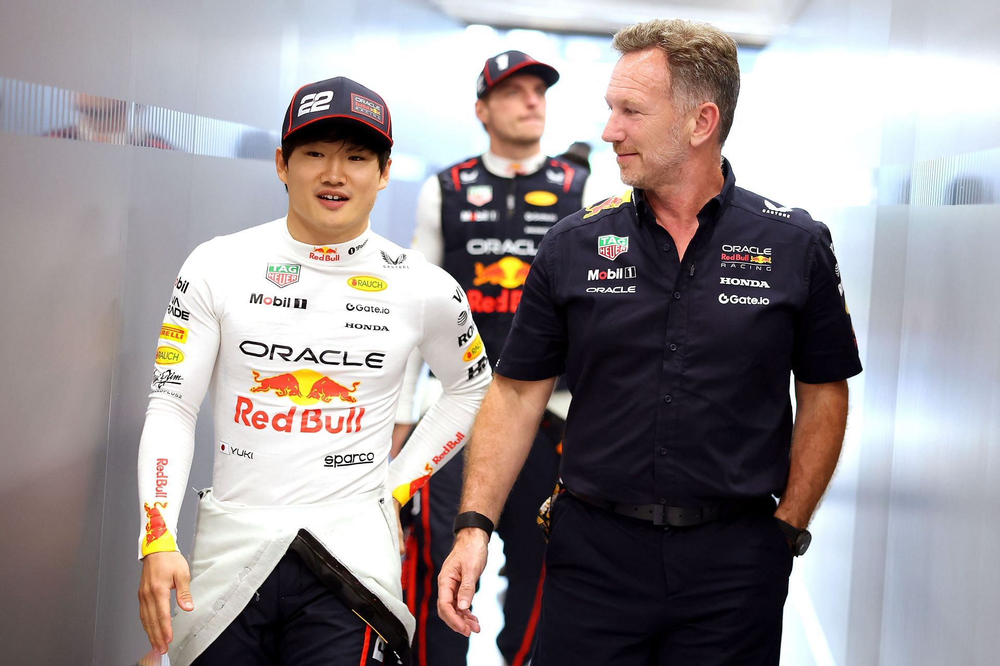

Starting from 2024, the rumor mill spun endlessly: Liam Lawson would go to Red Bull for 2025. He replaced Sergio Perez, who was released early, breaking his contract at the cost of huge money. Red Bull opted for the less experienced Liam Lawson over Yuki Tsunoda, which turned many heads.

As far as Red Bull is concerned, it has been disastrous. Come 2025, Liam Lawson never made it into Q2 in that Red Bull second seat. No points, and he even qualified last in China. Then after just two races, Red Bull decided to switch Liam Lawson with Yuki Tsunoda.

It's a good decision since Yuki instantly performed better. However, as months go by, we've realized that he still suffers the same problems as his predecessor, and to tell you the truth, it's getting worse and worse for him. As of writing this blog, he qualified last in Spain while his old colleagues in the "junior" team are P9 (Isack Hadjar) and P13 (Liam Lawson) respectively. If he makes a step forward in the future, I don't think it would necessarily be a big one. We've learned from Sergio Perez that nobody has (or will, potentially) ever gotten very close to Max Verstappen consistently.

## The Yuki-Liam Shenanigans
I'll be that one asshole to say "I told you so," because I knew this was going to happen. I've been a supporter of Liam for quite a long time, so I've seen his journey through the ranks. The moment the rumors of him getting "promoted" intensified, I immediately had a bad feeling and went against it. I actually voiced my worries on Reddit, if you don't believe me.

Why would I say that? Because as much as I believed in Liam Lawson after seeing his F2, SF, and DTM performances, I still think he was too unproven in Formula One. Indeed, he's very close to Tsunoda in terms of qualifying pace and race pace. He also more or less continued where Daniel Ricciardo left off. But I had many questions about his performance that remained unanswered because he had very little sample size - just eleven races.

Yuki should've been in the second seat in the first place. It was an obvious choice, so God knows why they decided Liam was the way to go. Yuki is the most experienced Red Bull junior ever, with 4 seasons before his (supposed) promotion. At that point, Yuki had raced in at least 80 grand prix, so it goes without saying he has dealt with various issues during weekends, whether they're individual issues, setup issues, or track issues. So if we're talking about preparedness, Yuki was far more prepared than Liam.

:::note[Honda influence?]
One theory for Red Bull avoiding Yuki was because Honda was leaving Red Bull by the end of the year. It's a very loud opinion, but to be honest, I don't buy it. Giving Honda a favor is exactly what Red Bull should do. It would've opened a chance for rebuilding the relationship.
:::

<iframe width="100%" height="468" src="https://www.youtube.com/embed/d5GtJrtwZxA?si=a1gbjSffX2aLLWyq" title="YouTube video player" frameborder="0" allowfullscreen></iframe>

On the other side, Liam could only prove himself with words. I don't mean this in an offensive way whatsoever, but the truth is that with only eleven races under his belt, there was very little data or samples to back him up. As I said, I had many questions: Has he shown any signs of growth at all? Has he solved his qualifying issues? How would he deal with the pressure of being a full-time F1 driver? Observing his junior career leaves you with more questions than answers.

The wisest choice from the beginning would've been promoting Yuki Tsunoda to Red Bull and welcoming Liam Lawson to Racing Bulls. That way, Yuki would've been better prepared for the season, and Liam could've been assessed more appropriately.

## The Real Problem
But of course, in the grand scheme of things, the second driver problem goes deeper than what we see. There are two things to discuss: the car and driver mismanagement.

The car. Let me be quick - nobody can handle the current car other than Max Verstappen. As a mere audience member, there's no way I can dive into the more technical aspects without spreading misinformation. But from what we've heard, the car's working window is bafflingly tight. That's why qualifying has been very hit or miss for both Sergio and Yuki. They can sometimes be considerably close to Max, but in a matter of moments, they can be at the total opposite end.

Ever since 2022, the car's handling has gradually worked against the RB second driver. We've seen Sergio gradually drift away from Max in terms of pace even though he was fairly close to him in the beginning. In fact, Liam Lawson was fifth in Abu Dhabi FP1, just under 3 tenths behind Sergio Perez on his very first Red Bull outing. Yet in 2025, he has never been within the top 10 in Free Practice sessions. The only reason this can happen is that the car has gradually gotten worse as the season's development progresses. It has gone in a direction that only Max Verstappen can handle.

I can't quite blame Red Bull for favoring their golden boy, but frankly, for Red Bull, Max Verstappen is both a blessing and a curse. Development is always based on driver feedback, so when your driver is a generational talent who can essentially handle any type of car and be fast, the development direction becomes just that: a car that is fast and only a generational talent can handle. To get slightly off-topic, it's reminiscent of how Marc Marquez shaped Honda's development philosophy in MotoGP over the years.

*Should've just promote Franz Hermann.*

Next, driver mismanagement. Okay, so listen: in 2023, Red Bull placed Nyck De Vries out of nowhere in the junior team over their own junior driver, only to drop him a few races later in favor of evaluating their "bestie" Daniel Ricciardo. They stuck with him for a season and more, further delaying their own junior driver cycle, only to eventually drop him mid-season and finally promote the junior driver. What I can say is that they experimented a little too much.

Who is the junior driver in question? Liam Lawson. Yes, this will be the part where I defend him a little. Between Nyck De Vries and Daniel Ricciardo, that's about 35 races he missed out on, plus some pre-season testing. Not only did Liam miss valuable experience, I feel like Red Bull also missed a proper assessment that could have supported their decision for their second driver.

To be fair with Red Bull, Liam wasn't very convincing by the end of 2022. He was barely ahead of his rookie teammate Logan Sargeant in F2 (although he had a lot of bad luck) while also getting beaten convincingly in the qualifying statistics. In a series like F2, where qualifying is so crucial, the race results follow. That's why he never won a feature race, though he won a few sprint races which are coincidentally reversed-grid races. Therefore, Red Bull opted for further development and put Liam in Super Formula.

However, I feel like putting him in that particular series was counter-productive to what Liam really needed. In hindsight, the Super Formula races represent very little of what an F1 car offers, both in terms of the car itself and engineer communications. It also has very few races - 9 compared to F1's 22 races. It would've been better to put him straight into the F1 car and let him learn in the true environment, not in other series. Also, don't leave your junior drivers vacant for about a year, please.

Has this 'driver mismanagement' hampered Liam? I think so. I also think that all the shenanigans he pulled in 2024, like the iconic 'not here to make friends' comment, came out of desperation from not getting the seat he really needed. But at the same time, it shouldn't be used as an excuse for his bad performances. Red Bull (and I) have praised Liam for his adaptability. Yet so far, his adaptability has only gotten him to be a 'decent driver.'

To put some closure on my Liam Lawson thoughts, let me be frank. I'm quite disappointed with Liam so far in his Formula One campaign. He's shown little signs of progress and even though he has about eleven races of experience compared to his current teammate (Isack Hadjar) who has zero races, he's shown very little use of that experience. Added to that, he's been quite incident-prone, making unnecessary contacts and impatient moves. It's not like I'm completely tearing up my "Liam Lawson fan card," it's just that he's been very desperate most of the time, visibly losing his cool, and not the same aggressive yet composed Liam I've been rooting for.

## The Next In Line
In between the Yuki Tsunoda and Liam Lawson shenanigans, there's one driver who unexpectedly became the spotlight. Yes, everyone's favorite (including mine, now): Isack Hadjar. He was initially promoted as a filler and predecessor for Liam Lawson, yet right now he became one of the best rookie stories of Formula One.

Isack hasn't had a particularly flashy junior campaign. In fact, I felt like it was quite unusual. He has never won a karting or junior formula championship. He's been runner-up many times, including in F2, and yet out of nowhere in F1, he became a second coming of Max Verstappen (ahead of the supposedly real one, Kimi Antonelli).

He outqualified Yuki on his second attempt while also being very close to the latter's race pace (albeit with only one race and sprint sample), then dominated Liam in both race and qualifying head-to-head. He's quick but also outrageously consistent, scoring 21 points so far and carrying Racing Bulls to sixth place in the constructor standings.

What I also find impressive about Isack is the pattern of his weekend performance. As the weekend begins on Friday, he's either fast straight away or a little bit behind Liam. If it's the latter case, however, he'll arrive the next day, find some impressive pace, and eventually pull himself into Q3, far ahead of Liam. The race points are just the reward. What I see here is a pattern of good feedback and excellent problem-solving, knowing exactly what he needs to get quick and extract the maximum from his car.
We often see that with Max - albeit with little help from simulation drivers. Max sometimes will be quite dejected with Friday practices only to put himself on pole position the very next day. He seems to have a very good feel and understanding of the car. If it's a similar case for Isack, then it bodes very well for his future - it's exactly the kind of driver Red Bull needed.

Although, the question we should be asking is whether it's truly his raw pace or simply because his driving style suits the car. It's difficult to ignore because his junior campaign wasn't exactly that of a serial winner or generational talent like Max Verstappen, George Russell, Oscar Piastri, or even Lando Norris. That's why Red Bull initially sort of rolled their eyes at Isack, and I think they need to stay skeptical.

To be fair, Isack is only 20 years old and probably could only just be beginning the exponential climb of the learning curve. The talent we're seeing right now could be the real deal, so it needs very careful handling. I think the right approach with Isack is to observe him for at least one year, coupled with a few Red Bull tests, before a promotion to Red Bull. The team really needs to avoid the misstep of instant promotion while also avoiding disrupting their own junior driver cycle, because they also have an excellent candidate lining up in the queue.

Arvid Lindblad, only 17 years old, has achieved pole position, sprint wins, and feature race wins so far in Formula Two. He's another talent climbing up the ranks and also very likely to be another generational talent alongside Mercedes' Andrea Kimi Antonelli. He's so close to getting his Super License and will definitely get an F1 seat next year.
Honestly, I've barely observed Arvid throughout the year, so I barely know anything detailed about him. He was 4th in F3, even though if you look at his latest results, he nearly missed out on the title (he had a horrendous streak of no points) whether from bad luck, bad performances, or something else. He won a regional formula, some karting championships, F4 Macau, and was runner-up in multiple other regionals. What's impressive here isn't those results, but the age when he achieved them. The kid has real talent.

## The Next Step
So, how should Red Bull approach this driver complication?

Firstly, Arvid Lindblad absolutely cannot be ignored. He has to be in F1 next year and should follow the same path as Max Verstappen. That means one of Red Bull's four drivers has to be ousted, or they find another seat somewhere else, or... just let Max go somewhere else - Mercedes, Aston, or something (no way). I'm inclined to go with the first choice.

Then, it's between Yuki Tsunoda, Liam Lawson, and Isack Hadjar - someone needs to go. We can cross off Isack Hadjar already, since he's been quite impressive and shown great flashes of talent. Yuki or Liam? This is where I get a headache because Red Bull has faced this choice before - we know where they went, and where they went wrong. Also yeah, I have some bias.

Bias aside, I feel like the wisest choice after all is to drop Liam Lawson, give Yuki another year to try the new Red Bull (since it's all-new regulations), and give Isack another year to develop and prove himself in a different kind of car. It will hurt and be unfair to Liam after the effort he's put in, but he had his chances - hopefully he could get another unlikely seat or compete in WEC, a class that he has proven himself on.

However, what concerns me is Red Bull's attitude toward Yuki. It always seems like he's been overlooked by the team several times, and there have been comments about letting him go ever since Liam's promotion. That might have changed after his own promotion, but after a string of bad performances, the team might very well evaluate dropping him - continuing another cycle of junior driver mismanagement.

Whatever path Red Bull takes, I hope they consider it very carefully. They're in the middle of yet another crossroads, and if another junior has to suffer because of their mismanagement, they'll truly lose a lot of respect.

Either way, it's their headache to solve, so I should just relax with some popcorn.