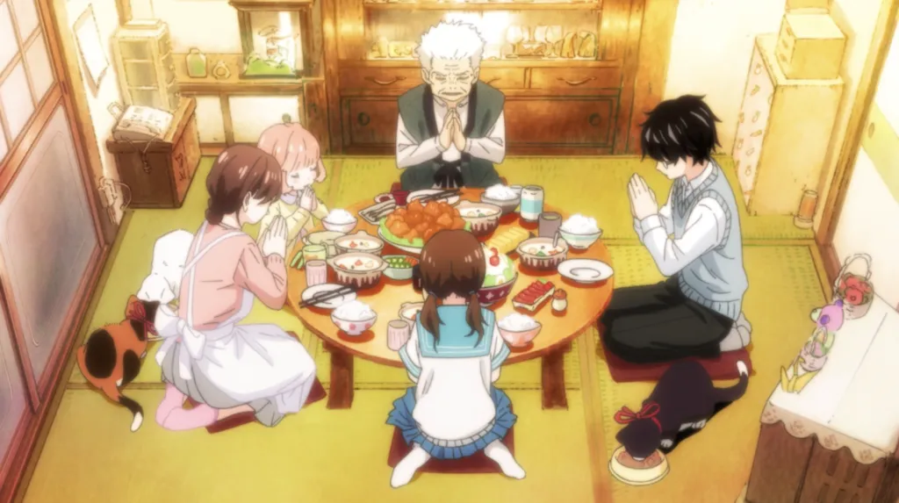
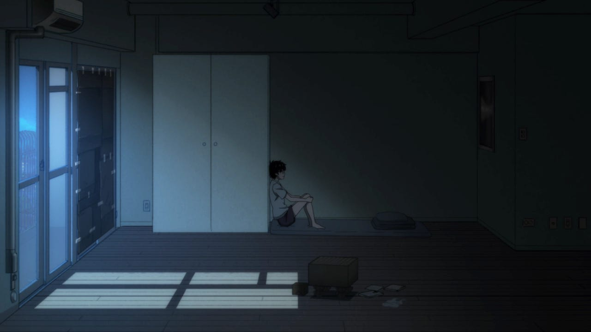
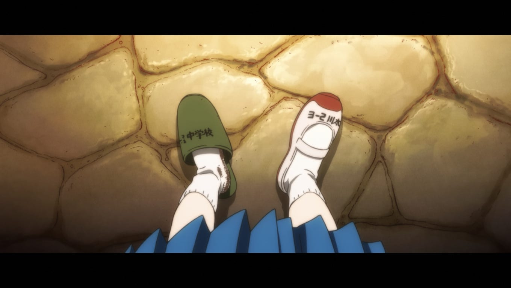
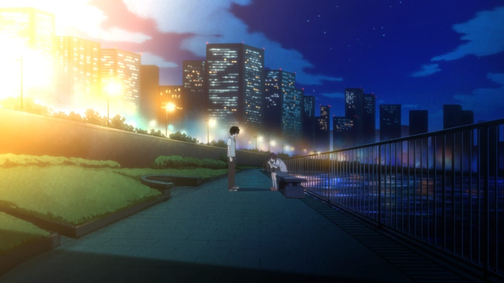
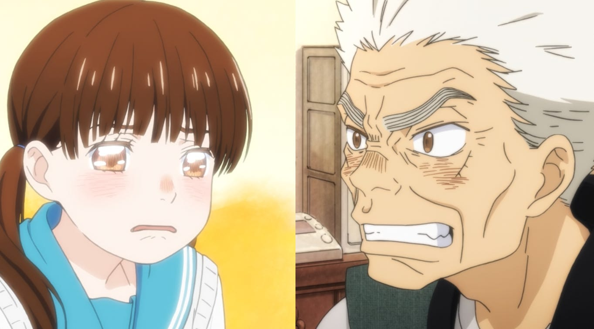
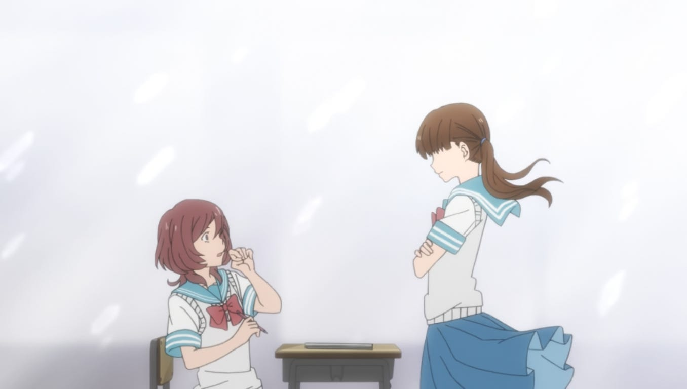
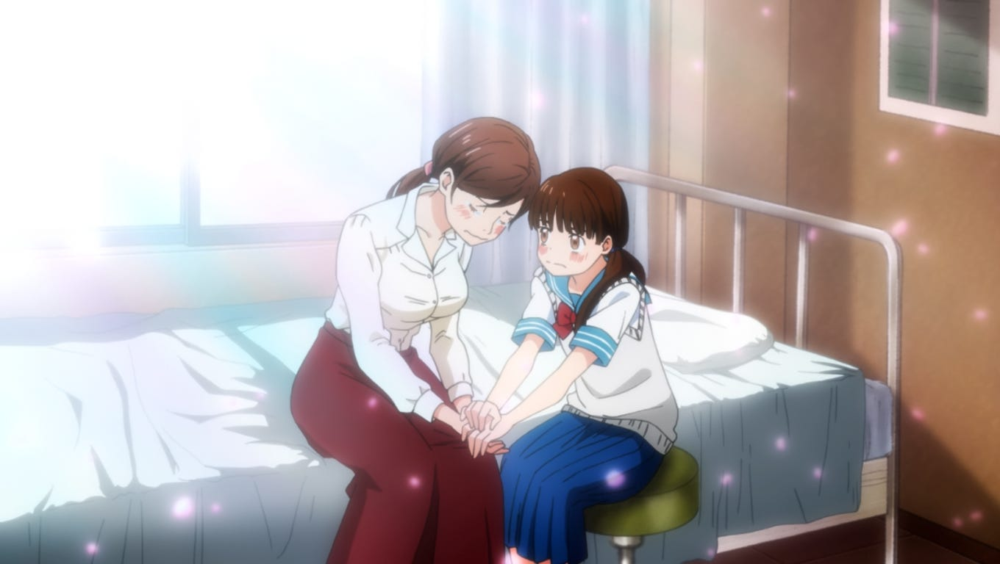
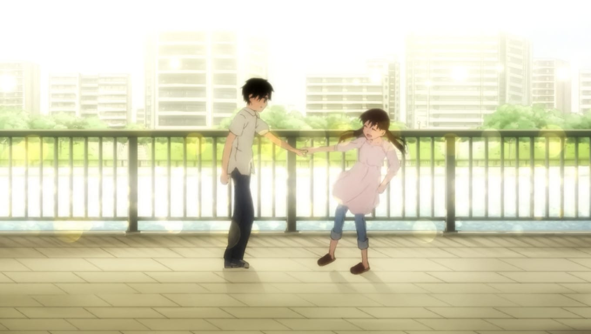
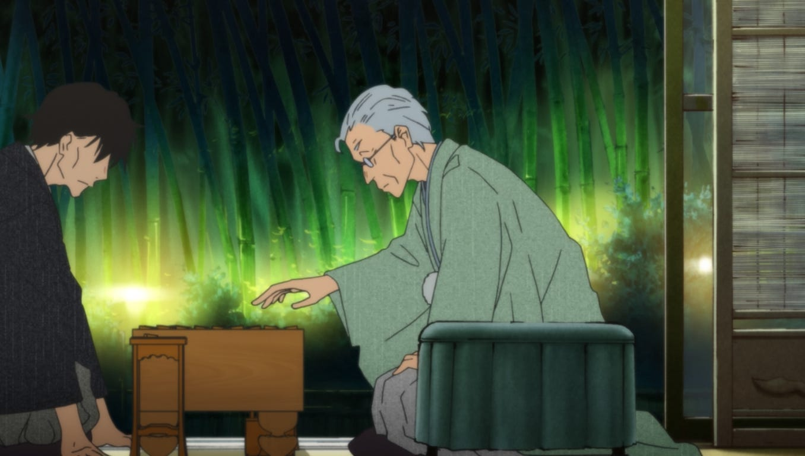

:::note[Spoiler alert for March Comes in like a Lion Season 2!]
I can recommend you to read the first and last few paragraphs of this blog to interest yourself to the anime. However, if you want to avoid spoilers altogether, then you know, just watch the anime!
:::

"March Comes in like a Lion" is an anime about life. It tells the story of how one struggles within the confines of their mind on a cold, lonely path, and how a glimmering light gradually warms their heart, allowing them to embrace others.

It's the story of Kiriyama Rei, a 17-year-old professional shogi player, hailed as one of the most promising prodigies in the world of shogi. However, while shogi plays a significant role within the plot of March Comes in like a Lion, the anime is far from a typical competitive sports story. Instead, it focuses on the young boy's struggles and his gradual reconciliation with his mental issues.

The first season starts off quite slowly. Chica Umino, the writer, invests a considerable amount of time exploring the main character, giving us a glimpse into Rei's self-consuming depression. It's subtly portrayed, delving deep into his thoughts and behaviors, highlighting its negativity. Unlike some anime that depict depression with gloomy, exhausted characters, this anime carefully implies the mental issues.

This initial part of the anime might seem dull to some, as I initially thought too, but it lays the foundation for what comes next.

Additionally, we're introduced to other characters who have become integral parts of Rei's life. These include his adoptive family, friends, and rivals within the world of shogi, and the one I’ll be touching upon, the Kawamoto family.

At the start of March Comes in like a Lion, Rei is living independently and has moved out of his adoptive family's residence. He seems to be heading down a path of loneliness, residing in an almost empty apartment furnished with little more than a tall cabinet for his clothes, a kitchen set for food, a shogi board for work, a bathroom, used cardboards substituting curtain, and a cheap kotatsu for rest. He often isolates himself within his apartment, playing shogi and neglecting his own health, frequently eating instant or unhealthy food.

Consequently, his professional life in shogi is also taking a hit. After climbing the ranks and earning promotions after promotions, he now faces a demotion. He's caught in a losing streak, burdening his mind with intrusive thoughts and insecurities, overwhelmed by the expectations of those around him.

Much like his apartment - which lacks sufficient light - Rei's life is gradually being consumed by darkness.

Rei Kiriyama's Curtains — Lighting in March Comes In Like A Lion | atelier  emily
Rei’s life on his apartment
Then, there comes the Kawamoto family. This family consists of three sisters: Akari Kawamoto (the eldest), Hinata Kawamoto, and Momo Kawamoto (the youngest), along with their grandfather, Someji Kawamoto. They become a vital source of warmth for Rei, offering delicious meals, a cozy kotatsu, and all sorts of kindness. Throughout the first season, we witness this family gradually becoming a significant part of Rei's life. They’ve became a second family for Rei.

---

## Ladybug Bush
The beginning of the second season marks a significant event in Rei's life, one that sets him on a path toward positive change, which all started within "The Ladybug Bush" chapter.

In the early episodes of the second season, Rei's bond with the Kawamoto family has deepened. He starts visiting their home more frequently, either simply for dinner or to lend a hand. Simultaneously, we witness progress in Rei's mental health. Thanks to his schoolteacher, who happens to be a fan of his, Rei is invited to create a shogi and science mix club. For the first time, Rei makes friends at school and begins to experience the joy of a school life.

However, an unexpected event strikes the Kawamoto family one day. Hinata Kawamoto, the middle child of the Kawamotos, returns from middle school in tears, her arrival marred by a gruesome sight: she has arrived without one of her shoes. Hinata Kawamoto has become the target of bullying, a revelation that shocks the family and undoubtedly leaves them under a lot of questions.

Hinata Kawamoto, we call Hina, recounts the story. Initially, she wasn't the target of the bullying. The bullying had begun with her classmate, Chiho Sakura, who also happened to be Hina's childhood friend. Being a kind girl she's been, Hina tried to step in and protect Chiho. She talked with Chiho, shared lunches, and offered emotional support to ensure she didn't fully feel left out.

Hina sought help from her friends, but they all declined, citing excuses such as "the entrance exam is approaching" or "I'm busy." In truth, they were simply afraid. One of her friends warned Hina that if she continued to support Chiho, she would also become a target of bullying. But Hina persisted in her efforts to help.

Hina also turned to her homeroom teacher for assistance, only to be met with surprise as the teacher turned a blind eye to the bullying, dismissing it as "harmless pranks." This was a shocking revelation, and it exhausted Hina out of options.

Eventually, the bullies prevailed. Chiho broke down mentally, stopped attending school, and moved away to the village where her father resides. Hina felt sad and defeated when this happened. The bullies, however, ignorantly ridiculed Chiho further. This triggered Hina to physically attack one of the bullies, venting all of her frustrations and rage towards the bullies. However, unfortunate for Hina, this played right into their hands.

Hinata Kawamoto became their next target for bullying.

Before we continue, I'd like to share some thoughts.

Firstly, it's quite strange to witness bullying, especially when it happens to a character we've already grown attachment to. This is precisely what I meant when I emphasized the importance of character exploration in the first season. Many anime introduce characters when bullying is already occurring or has occurred, that we met a character with a bullied background. In March Comes in like a Lion, we've come to know Hina as a bright, cheerful, kind girl who easily socializes. It's difficult to imagine her becoming a target of bullying, and yet, she is. The sight we've seen at the beginning of Ladybug Bush was a shock to everyone—to the characters or the audience. It underscores a scary thought, that under the circumstances, bullying can happen to anyone, even someone we know regardless of their personality.

Secondly, the bullying portrayed in this arc feels very realistic. I've never been a victim of bullying, and, to be honest, the word "bullying" held little significance in my life until later in my teenage years. However, the feelings of helplessness and loneliness—when Chiho is isolated by her classmates (except Hina) or when Hina attempted to seek help from others, only to be met with excuses—are truly soul-crushing. We feel empathy, a desire to provide a solution, but when we look around, we just don't know how. Find the root of bullying is already difficult by itself, let alone formulating a solution.

A question may looms as you watch this arc: why? Why did Hina help Chiho? Why did Hina go to such lengths, exposing herself as a potential next target, when she could have ignored the situation like everyone else? To answer this, I love the point made in a blog called “Beneath the Tangle”: it's all because of love.2 Growing up, Hina is taught to be kind to others, so it's a natural response for her to offer help to someone in need. This natural kindness, coupled with her deep affection for her childhood friend, compelled Hina to help Chiho, no matter the cost. And as she found out the hard way, it costs her a lot—her entire school life.

Returning to the anime, there's a charming scene under the moonlight by the March River. Hina sits with tears, while Rei stands before her, at a loss for words. Hina opens up about her fear—that her enjoyable school life and friends will vanish, leaving her alone for the rest of the year. She questions why her friends can simply ignore Chiho, why the teacher can act as if nothing happened. Then, she makes a declaration, offering us and Rei a glimpse into her admirable resolve.

> "Why did this happen? The school was so much fun every day until the second year. Chiho was stressed with everything, so why did everyone—why did they pretend not to see anything or say 'if you protect her, they will target you next'? Why?
> But it turned out just as they thought. I'll be alone tomorrow. I'll— I'll be all alone, I'm scared. The truth is, I've been scared this whole time.
> But I don't regret anything! I can't! Because what I did was definitely not wrong!"

Even after enduring the hardships and pain, she doesn't believe she was wrong. And, heck, she was obviously and absolutely not wrong. Not at all. However, it's impressive how this middle school girl persists. She is strong at heart, very strong, far more than I could ever muster, let alone act upon.

School and family are significant parts of Hina's life. Her school life is falling apart, a once-enjoyable place now filled with misery. Thankfully, she at least has a friend, Takahashi, who occasionally lends her a helping hand. He also knows Chiho and appreciates Hina for her actions. However, aside from him, Hina still has her home to look forward to.

Emotional support is vital for Hina's well-being, and her family provides that support. Her older sister, Akari, offers kindness, the comfort and nourishment she needs. Akari essentially acts as a mother figure to Hina. Then there's Rei. We'll explore Rei's intentions more deeply later, but essentially, he provides a safe space for Hina to pour out her heart; vent. They play shogi in her room, with Hina speaking and Rei listening. All he does is listen, but in retrospect, his presence is more than enough to help Hina in that moment—although he may not have been aware of that fact.

And then there's the wisdom of her grandfather. Despite Hina's conviction that she's right, something crucial is still missing: affirmation. She believes she's right, but she's still filled with doubt and feelings of being lost. The day after we learn about the bullying, her grandfather delivers powerful reinforcement to Hina.

> “You are amazing!”
> "You've done nothing wrong. You are right, you are brave. Not even an adult could have done what you did. I'm proud of what you did."

It's another powerful declaration, spoken with a clear voice that echoes the room, and his words reaches Hina and bring tears her eyes. It's a pivotal moment, one that further strengthens Hina's resolve and, I believe, will play a key role in concluding this entire arc.

Of course, providing emotional support is one thing, but solving the problem is another. For a while, they find themselves at a stand still. Neither her family nor Rei unable to make any progress on the bullying matter, and all they can do is continue offering emotional support.

But then, one day, the gears begin to turn. In class, Hina is accused by one of the bullies of stealing the teacher's lost property. Thanks to all the emotional support she's received, Hina bravely fights back, stepping in and demanding that they stop. She quite literally stood up before the bully, questioning their actions. With a voice that echoes throughout the class, she asks, "why?" while the bully is left unable to answer.

This is the moment when the homeroom teacher revealed her issues as well, visibly anxious, she's aware of the bullying, yet feeling helpless—believing that nothing could've been done, so she decided to ignore it. However, things escalated so badly that even the homeroom teacher herself became a target of the bullying. In that moment, the teacher rambled at length, broke down; collapsed, unconscious.

The incident created a significant noise within the school, prompting the head teacher himself to step in. However, little did they know, this was a good omen for Hina and her school life.

The head teacher, upon learning about the bullying, called for a parent-teacher conference. The conference had a touch of drama when Hina and Akari had a moment. By chance, the parent of the bully crossed paths with Akari, leading to an argument. It was a short-lived heated exchange, during which Akari, constantly under attack, asked, "Where's the proof?" She stood at place, at a loss for words. A quick-thinking by Hina stepped in and excused Akari to the infirmary's room.

Here, once again, Hina displayed the strength of her heart. While her sister, Akari, is composing herself and apologized to Hina for not being able to do anything, Hina reassured her, thanking Akari for her efforts.

> "I understand now, the bullies will never admit they're wrong. Just like Chiho, once it's over, they'll forget it. So, I won't let them do what they want. If they bully me, I'll yell them to stop. I refuse to be quiet. As long as I survive and graduate, it's my victory!"
> "So it's fine. Thanks for coming, sis. Thank you."

The head teacher observed the situation. By that point, it seemed like the head teacher had grasped the dynamics of the situation, understanding both the bullies and the bullied. In a calming and soothing tone, he spoke to Hina and Akari.

> “You have nothing at all to be worry about. It’s fine. More importantly, why don’t we talk about the next steps?”

And with that, marks *the end of the bullying of Hinata Kawamoto*.

The aftermath unfolded soon after. The bullies were individually questioned by a team and subsequently—albeit insincerely—apologized for their actions in front of the class. The teacher managed to dispel the tense atmosphere that had gripped the class. Hina's friends all apologized for their inability to help, and they quickly made amends with each other. Additionally, Hina also received a letter from Chiho, inviting her for a visit later on the summer break.

There was a moment between the head teacher and Hina in the aftermath. Hina stated that despite the apology, she'd never be able to forgive them, and she asked the teacher, "Is it okay for me if I don't forgive them?" This is reasonable. It is important for one to open their heart, to accept forgiveness, but at the same time, it's difficult to forgive after everything she's been through, especially with mere words.

After the conversation, the head teacher had a thought. Which, for me, who's always been pushed to be an educator by my family, was really fascinating.

> "Education, huh? If only it were as easy as it sounds. Our job is to teach and raise students. If not for 'raise,' I would have never gotten involved in this whole issue."

What a headache, huh? However, in all fairness, the teacher did a really great job handling the situation. He provided a solution that's beneficial for all parties, especially for Hina. He made Hina feel like she belonged at school and returned her life to normality, which is no easy task.

Afterwards, Hina's energetic and cheerful mood returned, and she became the person she used to be, perhaps even brighter.

Now, let's talk about Rei.

When Hina made her first declaration, Rei stood before her speechless. Rei himself was a victim of bullying when he was younger. However, unlike Hina, Rei chose to escape. He ignored the bullying that was happening to him and avoided the issue by isolating himself. The bullying that had haunted him for a long time and continued to affect him even to the present, so in a way, it was still ongoing. That's why Hina's actions felt like a salvation to Rei. He felt that Hina had extended her hand to a young Rei, offering help—something that Rei had silently yearned for but could never seek out.

Since then, he visited the Kawamoto's home often, bringing sweets and food that cheered up Hina. He grew attached to the family. Simultaneously, his shogi career improved as he finally found his drive. Previously, Rei played shogi for himself, with no significant purpose. But since the Ladybug Bush, he played for Hina. He understood that the best way he could help was by winning as much as possible, earning more money, and ensuring that the Kawamoto family didn't feel responsible for any negative impact on his career.

In fact, the opposite happened. Fast forward to the end of the anime, and even beyond, this event marked the beginning of a rapid progression in Rei's career. After being stuck at the same rank for a long time, Rei turned things around, earning promotions and achieving a strong winning streak.

I believe this highlights the power of drive or motivation. Knowing who or what you're fighting for, such as family or someone you deeply care about, gives you a stronger drive and enables you to achieve things you couldn't have imagined before. Consequently, Rei's mental health also significantly improved. He started to have healthy relationships with others and achieved a much better work-life balance.

The bullying of Hinata Kawamoto was a significant part of the Kawamoto family's and Rei's lives.

For Hina, it feels like she has gained a boost in self-esteem. The pain she endured, undoubtedly, will only make her stronger, and her victory even more significant.

Akari should feel a similar way. Although, in the end, she might feel guilt for not being able to help her sister as much as she expected, she should also take pride in fulfilling her promise to their mother—to stand by Hina's (and Momo's) side no matter what.

As for Rei, this event profoundly impacted his life. At the time, he might not have realized it, but he found the love of his life. Rei discovered his motivation—a reason to fight for someone he cares deeply about and looks forward to seeing, someone he can rely on. Honestly, I'm astonished by the transformative power of love. His life improved in every way, and if you've watched the last episode or stick longer for the manga, you'll see how different he is in the present. In short, it made me realize that love is genuinely powerful.

---

## Closing Words and Conclusion
When I decided to embrace watching anime after two years of pure disinterest and perhaps even a bit of hatred, I made a little plan for myself: watch two episodes per day. This way, I could grasp the story, enjoy the show better, and do so in a healthy manner.

In hindsight, I'm very happy that I chose March Comes in like a Lion as the third show I watched since then. The entire twenty-two days, along with an additional five days to catch up on the manga, have been a blissful experience for me.

The Ladybug Bush (bullying arc) was a truly memorable part of March Comes in like a Lion. I first watched this anime about six years ago, back when I was still in high school. I distinctly remember that this arc was the moment I decided March Comes in like a Lion was my all-time favorite. Fast forward to the present, I had almost forgotten why I held it in such high regard. However, watching it again instantly reminded me why. Certain moments in the anime always give me slight goosebumps, even when I just recall them in my head.

It also made me reflect on how ignorant we can be toward fiction works. There are countless non-fiction self-improvement books out there, offering practical, step-by-step ways to improve your life. However, very few people take the time to immerse themselves in fiction works, to put themselves in the characters' shoes and learn through empathy.

Besides that, it also highlights a very important problem caused by bullying. I might be not the best person to present data for you, so I’ll link you a relevant blog about it.3

Kiriyama Rei is one of the most relatable characters for me, and watching his problems slowly fade away provides a great sense of relief and inspiration for me. I also must reiterate that I truly, truly, truly, truly! admire the strength of Hinata Kawamoto. I had always perceived Hina as nothing more than a cute and cheerful little girl, yet when she expresses her feelings, it reveals her courageous and strong heart. (*I envy you, Rei! But good for you, my man!*)

March Comes in like a Lion is a fantastic show that potrays a lot kind of mental struggles and is crafted in a character-driven manner, which I thoroughly enjoyed. It's worth mentioning that while the anime primarily revolves around Rei and the Kawamoto family, it also delves into many other interesting characters. A few of my favorites are Shimada, Yanagihara, Souya, and Nikaidou.

So, if you have the patience to sit down and watch a slow-paced forty-four-episode slice of life drama anime, I wholeheartedly recommend March Comes in like a Lion. Just a word of advice: try to avoid binge-watching. Anyway, thanks for reading.